# ⚡ AI-Powered Renewable Generation Forecasting Platform
### High-Resolution Solar & Wind Generation Forecasting, Grid Code Compliance & BESS Optimization

[](https://www.python.org/)
[](https://fastapi.tiangolo.com/)
[](https://reactjs.org/)
[](https://vitejs.dev/)
[](https://xgboost.readthedocs.io/)
[](https://www.docker.com/)
[](LICENSE)

---

## 🌟 Executive Summary

The **AI-Powered Renewable Generation Forecasting Platform** is an enterprise-grade digital twin and decision-support system engineered to solve the intermittency and grid integration challenges of large-scale solar and wind power plants.

Designed around the operational framework of the **Indian National Electrical Grid**, the platform provides day-ahead and intra-day power predictions, mathematical hierarchical aggregation across all 5 regional grids (NR, WR, SR, ER, NER), CERC Deviation Settlement Mechanism (DSM) regulatory compliance, battery storage (BESS) co-optimization, TreeSHAP explainability, and real-time SCADA telemetry streaming.

---

## 🏛️ System Architecture

```mermaid
flowchart TB
    subgraph Ingestion["1. Telemetry & Atmospheric Ingestion"]
        NWP["NWP Weather Feeds<br/>(Open-Meteo / NASA POWER)"]
        SCADA["SCADA RTU Telemetry<br/>(1 Hz Generation & Grid Freq)"]
        Plants["Renewable Asset Registry<br/>(Solar, Wind & Hybrid Parks)"]
    end

    subgraph Physics["2. Physics-Informed Feature Engineering"]
        SolarGeom["Celestial Geometry<br/>Zenith, Air Mass, DNI/DHI/GHI"]
        WindAero["Turbine Aerodynamics<br/>Hellmann Shear, Air Density ρ, WPD"]
        TimeHarm["Temporal Dynamics<br/>Fourier Harmonics, Lags & Rolling Trends"]
    end

    subgraph CoreML["3. Predictive ML & Uncertainty Engine"]
        SolarModel["Solar XGBoost Regressor<br/>R² > 0.94, MAE < 30 MW"]
        WindModel["Wind XGBoost Regressor<br/>Turbine Power Curves & Cut-outs"]
        Conformal["Conformal Calibrator<br/>P10, P50, P90 Quantiles"]
    end

    subgraph Hierarchy["4. Exact Bottom-Up Aggregation"]
        FarmAgg["Farm Level (12 Facilities)"]
        StateAgg["State Grids (RJ, GJ, KA, TN, etc.)"]
        RegionAgg["Regional Grids (NR, WR, SR, ER, NER)"]
        NationalAgg["National Grid Dispatch"]
    end

    subgraph Decision["5. Operational & Regulatory Intelligence"]
        Explain["TreeSHAP Explainability<br/>Waterfall Local Attributions"]
        BESS["BESS Co-Optimizer<br/>Arbitrage, SoC Tracking & Degradation"]
        DSM["CERC DSM Engine<br/>96 Time-Block Graded Penalties"]
        Drift["MLOps Drift Monitor<br/>Kolmogorov-Smirnov & Retrain Gate"]
    end

    subgraph Presentation["6. Full-Stack Command Center"]
        REST["FastAPI REST Endpoints<br/>(RBAC Gated, BCrypt, JWT)"]
        WS["WebSocket Streaming<br/>(1Hz Telemetry & Live Alarms)"]
        UI["React 18 / Tailwind / Lucide<br/>(GIS Maps, Telemetry, Charts)"]
    end

    Ingestion --> Physics
    Physics --> CoreML
    CoreML --> Hierarchy
    Hierarchy --> Decision
    Decision --> Presentation
```



---

## ✨ Key Platform Capabilities

### 1. Physics-Informed Machine Learning Forecasting
- **Solar Forecasting Engine**:
  - Models celestial solar geometry: Solar Zenith Angle $\theta_z$, Solar Elevation $\alpha$, Optical Air Mass ($AM = \frac{1}{\cos\theta_z}$), Direct Normal (DNI), and Diffuse Horizontal Irradiance (DHI).
  - Enforces physical boundary laws: Non-negative generation ($P \ge 0$), strict nameplate capacity clipping ($P \le P_{\text{cap}}$), and zero power during nighttime ($GHI \le 0 \implies P = 0$).
  - Evaluates temperature derating ($0.4\% / ^\circ\text{C}$ above STC $25^\circ\text{C}$).
- **Wind Forecasting Engine**:
  - Implements the **Hellmann Power Law** for hub-height wind shear extrapolation:
    $$v(z) = v_0 \left(\frac{z}{z_0}\right)^\alpha$$
  - Dynamic atmospheric air density computation using ideal gas law:
    $$\rho = \frac{P}{R_{\text{spec}} \cdot T}$$
  - Theoretical Wind Power Density ($WPD = \frac{1}{2}\rho v^3$) feature synthesis.
  - Turbines adhere to realistic cut-in ($3.0\text{ m/s}$), rated plateau ($12.0\text{ m/s}$), and storm cut-out trip ($25.0\text{ m/s}$).
- **Calibrated Uncertainty Bounds**:
  - Delivers P10 (optimistic), P50 (median expectation), and P90 (conservative lower risk envelope) intervals satisfying $\text{P10} \le \text{P50} \le \text{P90}$.

### 2. Exact Bottom-Up Hierarchical Aggregation
- Implements strict mathematical conservation across all 4 jurisdictional tiers:
  $$\text{Farm} \longrightarrow \text{State} \longrightarrow \text{Region} \longrightarrow \text{National}$$
- **Summation Proof**: Region forecast exactly matches the sum of its constituent farms at every hour $t$:
  $$\sum_{f \in \text{Region}} P_f(t) = P_{\text{Region}}(t)$$
- **National Summation Proof**: National total exactly matches the sum of the 5 regional grids (Northern, Western, Southern, Eastern, North-Eastern):
  $$\sum_{r \in \text{National}} P_r(t) = P_{\text{National}}(t)$$
- **Fuel Additivity**: Guarantees Solar MW + Wind MW $\equiv$ Total Renewable MW.

### 3. TreeSHAP Explainability & Attribution
- Calculates exact additive **TreeSHAP local attributions** for any facility and horizon hour:
  $$\text{Prediction} = \text{Base Value} + \sum_{i=1}^{M} \phi_i$$
- Renders dynamic waterfall visualizations attributing power variances to solar irradiance, ambient temperature, cloud cover, wind speed, and air density.
- Global feature importance rankings by Feature Gain, Cover, and Frequency Weight.

### 4. CERC DSM Regulatory Compliance & Settlement
- Automatically compiles standard Indian **96-time block (15-minute intervals)** daily generation schedules.
- Models Available Capacity (AvC) and graded deviation penalties as per CERC DSM regulations:
  - **Band 1 (Permissible Error $\le 10\%$)**: Zero regulatory penalty.
  - **Band 2 (Moderate Error $10\% - 15\%$)**: Graded penalty ($10\% - 20\%$ of PPA tariff).
  - **Band 3 (Critical Violation $> 15\%$)**: Steep deviation penalties up to $50\%$ tariff.
- Multi-format compliance export in **CSV, Excel (XLSX), HTML, and JSON**.

### 5. Battery Energy Storage System (BESS) Co-Optimization
- Dynamic linear-heuristic co-optimizer mitigating renewable curtailment and performing merchant price arbitrage.
- Respects electrochemical battery boundary constraints:
  - Power rating ($P_{\text{rated}}$) and energy capacity ($E_{\text{cap}}$).
  - AC-to-AC round-trip efficiency ($\eta \approx 90\%$).
  - Safe State-of-Charge operating limits ($10\% \le SoC \le 90\%$).
  - Cell degradation wear cost modeling ($\text{INR } 0.80/\text{kWh cycled}$).
- Computes avoided curtailment MWh, cycle degradation, gross revenues, and net arbitrage profit.

### 6. MLOps Drift Detection & Tournament Retraining
- Continuous statistical monitoring using **Two-sample Kolmogorov-Smirnov test** and **Population Stability Index (PSI)** across incoming telemetry.
- **Champion vs. Challenger Tournament Gate**:
  - Automatically triggers background retraining when significant drift is detected ($p < 0.05$).
  - Trains challenger models and validates on out-of-time test partitions.
  - Evaluates Normalized MAE (nMAE) and $R^2$ improvement threshold before promoting challenger to active champion.
  - Zero-downtime hot-reloading of model weights in the running forecasting engine.

### 7. Real-Time SCADA Telemetry & WebSockets
- High-frequency dual-stream WebSockets:
  - `/api/v1/telemetry/ws`: 1Hz broadcast of plant generation, grid frequency, irradiance, wind velocity, and active capacity factor.
  - `/api/v1/alerts/ws`: Real-time broadcast of severe ramp events, sensor flatlining, and high-wind storm trip warnings.
- Client-side auto-reconnection with exponential backoff and connection status telemetry.

### 8. Interactive Spatial GIS Map
- High-performance Leaflet-based spatial visualization with custom SVG turbine and solar markers.
- Multi-faceted interactive filters (Plant Type, Region, State, Capacity range, Alert status).
- Interactive fly-to camera animations, plant details drawer, and live telemetry previews.

---

## 📂 Repository Structure

```
hackout/
├── docker-compose.yml              # Root multi-container orchestration
├── .env.example                    # Environment variable configuration template
├── README.md                       # Master platform documentation
├── backend/
│   ├── Dockerfile                  # Multi-stage hardened Python container
│   ├── requirements.txt            # Pinned backend dependencies
│   ├── app/
│   │   ├── main.py                 # FastAPI application factory & middleware
│   │   ├── core/                   # Security, JWT, BCrypt, RBAC, settings
│   │   ├── database/               # SQLAlchemy engine & session management
│   │   ├── models/                 # ORM entities (Plant, Region, Weather, User, etc.)
│   │   ├── schemas/                # Pydantic validation contracts
│   │   ├── api/v1/                 # Versioned REST & WebSocket route handlers
│   │   ├── aggregation/            # Hierarchical aggregation engine
│   │   ├── alerts/                 # Anomaly detection & multi-channel dispatcher
│   │   ├── explainability/         # TreeSHAP & feature importance engine
│   │   ├── ml/                     # Physics-informed Solar & Wind ML models
│   │   ├── mlops/                  # Drift detection & retraining service
│   │   ├── reports/                # CERC DSM engine & multi-format exporters
│   │   ├── services/               # Forecast orchestrator & CRUD services
│   │   ├── storage/                # BESS co-optimizer & arbitrage simulator
│   │   └── telemetry/              # Real-time telemetry generator & broadcast
│   ├── datasets/                   # Regional plant metadata & historical time-series
│   ├── trained_models/             # Serialized joblib model artifacts
│   └── tests/                      # Unified 24-test validation test suite
│       ├── test_api_endpoints.py           # Suite 1: End-to-end API integration
│       ├── test_ml_and_physics.py          # Suite 2: Physical bounds & ML laws
│       ├── test_aggregation_hierarchy.py  # Suite 3: Hierarchical summation proofs
│       ├── test_security_audit.py          # Suite 4: BCrypt, JWT & RBAC audit
│       └── run_all_tests.py                # Master test runner with executive report
└── frontend/
    ├── Dockerfile                  # Multi-stage Vite build + Nginx Alpine runner
    ├── nginx.conf                  # Production reverse proxy & WebSocket configuration
    ├── package.json                # Frontend dependencies & build scripts
    ├── vite.config.js              # Vite bundler configuration
    ├── tailwind.config.js          # Custom Tailwind tokens & glassmorphism theme
    └── src/
        ├── App.jsx                 # SPA router & navigation shell
        ├── components/             # Reusable UI widgets, cards & tables
        ├── pages/                  # Top-level operational dashboards
        │   ├── OverviewPage.jsx            # National & Regional summary
        │   ├── ForecastDashboardPage.jsx   # Multi-horizon forecast analytics
        │   ├── SpatialMapPage.jsx          # Interactive Leaflet GIS map
        │   ├── ExplainabilityPage.jsx      # TreeSHAP waterfall & feature rankings
        │   ├── StorageSimulationPage.jsx   # BESS arbitrage & SoC profiles
        │   ├── AlertsManagementPage.jsx    # Anomaly feed & operator dispatch
        │   ├── ReportsCompliancePage.jsx   # CERC DSM & regulatory export
        │   └── ModelRetrainingPage.jsx     # MLOps drift & tournament retraining
        └── services/               # Axios API client & WebSocket connections
```

---

## 🚀 Quickstart Guide

### Prerequisites
- **Docker & Docker Compose** (Recommended for full-stack deployment)
- *OR* for local bare-metal development:
  - **Python 3.10+**
  - **Node.js 18+ & npm**

---

### Option A: 1-Command Docker Deployment (Recommended)

Clone the repository and spin up both services with Docker Compose:

```bash
# 1. Clone repository
git clone https://github.com/PrajapatiAbhishek-A194army/hackout.git
cd hackout

# 2. Copy environment configuration
cp .env.example .env

# 3. Build and launch containers
docker-compose up --build -d
```

Access the platform:
- **Frontend Command Center**: [http://localhost:3000](http://localhost:3000)
- **FastAPI Interactive API Docs**: [http://localhost:8000/docs](http://localhost:8000/docs)
- **Health Probe**: [http://localhost:8000/api/v1/health](http://localhost:8000/api/v1/health)

---

### Option B: Local Bare-Metal Development

#### 1. Backend Setup
```bash
cd backend

# Create and activate Python virtual environment
python -m venv .venv
# On Windows:
.venv\Scripts\activate
# On Linux/macOS:
source .venv/bin/activate

# Install dependencies
pip install -r requirements.txt

# Start backend development server
python -m uvicorn app.main:app --reload --host 127.0.0.1 --port 8000
```

#### 2. Frontend Setup
```bash
# In a separate terminal:
cd frontend

# Install Node modules
npm install

# Start Vite development server
npm run dev
```
Open [http://localhost:5173](http://localhost:5173) in your browser.

---

## 📡 Comprehensive API Reference

| Domain | Method | Endpoint | Description | Role / Access |
|---|---|---|---|---|
| **Health** | `GET` | `/api/v1/health` | Service health status & subsystem probes | Public |
| **Auth** | `POST` | `/api/v1/auth/login` | OAuth2 form login returning JWT bearer token | Public |
| **Auth** | `GET` | `/api/v1/auth/me` | Current authenticated user profile | Authenticated |
| **Auth** | `GET` | `/api/v1/auth/users` | List registered platform user accounts | Admin |
| **Plants** | `GET` | `/api/v1/plants` | Filterable list of solar/wind/hybrid plants | Public |
| **Plants** | `GET` | `/api/v1/plants/{plant_id}` | Detailed asset specs with live telemetry | Public |
| **Regions** | `GET` | `/api/v1/regions` | Regional grids (NR, WR, SR, ER, NER) | Public |
| **Regions** | `GET` | `/api/v1/regions/states` | State jurisdictional breakdowns | Public |
| **Forecasts** | `GET` | `/api/v1/forecasts/farm/{plant_id}` | Plant-level generation forecast (1-72h) | Public |
| **Forecasts** | `GET` | `/api/v1/forecasts/region/{region_id}`| Regional aggregated forecast | Public |
| **Forecasts** | `GET` | `/api/v1/forecasts/national` | National total generation forecast | Public |
| **Aggregation**| `GET` | `/api/v1/aggregate/national` | Exact bottom-up national sum | Public |
| **Aggregation**| `GET` | `/api/v1/aggregate/region/{code}` | Exact bottom-up regional sum | Public |
| **Aggregation**| `GET` | `/api/v1/aggregate/state/{code}` | Exact bottom-up state sum | Public |
| **Aggregation**| `GET` | `/api/v1/aggregate/farm/{code}` | Farm forecast points with P10/P50/P90 | Public |
| **Explain** | `GET` | `/api/v1/explain/importance/{model}`| Global feature importance rankings | Public |
| **Explain** | `GET` | `/api/v1/explain/shap/{plant_id}` | Local TreeSHAP waterfall attributions | Public |
| **Storage** | `GET` | `/api/v1/storage/profiles/{plant_id}`| BESS co-optimized dispatch & arbitrage | Public |
| **Storage** | `POST`| `/api/v1/storage/simulate` | Custom BESS scenario simulator | Public |
| **Reports** | `GET` | `/api/v1/reports/types` | Supported regulatory report formats | Public |
| **Reports** | `GET` | `/api/v1/reports/dsm/{plant_id}` | 96-time block CERC DSM schedule | Public |
| **Reports** | `POST`| `/api/v1/reports/generate` | Generate downloadable report file | Public |
| **Reports** | `GET` | `/api/v1/reports/download/{id}` | Stream generated file (CSV, XLSX, HTML) | Public |
| **MLOps** | `GET` | `/api/v1/mlops/drift/{model_type}` | Drift diagnostics & Kolmogorov-Smirnov | Public |
| **Retraining** | `POST`| `/api/v1/retrain/trigger` | Trigger tournament retraining pipeline | Admin |
| **Retraining** | `GET` | `/api/v1/retrain/status` | Current retraining pipeline status | Public |
| **Retraining** | `GET` | `/api/v1/retrain/history` | Tournament history & validation metrics | Public |
| **Retraining** | `GET` | `/api/v1/retrain/models` | Versioned model artifact registry | Public |
| **Telemetry** | `GET` | `/api/v1/telemetry/current` | Cached 1Hz telemetry snapshot | Public |
| **Telemetry** | `WS` | `/api/v1/telemetry/ws` | High-frequency telemetry broadcast | Public |
| **Alerts** | `GET` | `/api/v1/alerts` | Filterable active & acknowledged alarms | Public |
| **Alerts** | `GET` | `/api/v1/alerts/stats/summary` | Active alert counts & MW imbalances | Public |
| **Alerts** | `WS` | `/api/v1/alerts/ws` | Real-time alarm push notification stream| Public |

---

## 🧪 Testing & Validation Suite

The platform includes a master automated test suite verifying all architectural layers:

```bash
# Execute master test suite
cd backend
python tests/run_all_tests.py
```

### Executive Validation Results
```text
================================================================================
  EXECUTIVE VALIDATION REPORT
================================================================================
  Total Test Cases Run:   24
  Passed:                 24
  Failures:               0
  Errors:                 0
  Total Execution Time:   5.85 seconds
  Success Rate:           100.0%
================================================================================

[VERIFICATION CERTIFICATE] ALL PLATFORM LAYERS PASS 100% QUALITY VALIDATION!
```

- **Suite 1: End-to-End API Integration & Contract Verification** (12/12 Passed)
- **Suite 2: Machine Learning Invariants & Physical Bounds** (5/5 Passed)
- **Suite 3: Hierarchical Mathematical Aggregation Fidelity** (3/3 Passed)
- **Suite 4: Enterprise Security, BCrypt, JWT, RBAC & Audit** (4/4 Passed)

---

## 📜 Regulatory & Grid Code Alignment

This platform is architected in accordance with:
1. **Central Electricity Regulatory Commission (CERC)**: Deviation Settlement Mechanism and Related Matters Regulations.
2. **Indian Electricity Grid Code (IEGC)**: Technical standards for connectivity and scheduling of renewable energy generating stations.
3. **Renewable Energy Management Centre (REMC)**: Technical architecture standards for national and state-level dispatch forecasting.

---

## 👥 Contributors & Acknowledgements

Developed for the **HackOut Challenge** — AI for Renewable Generation Forecasting.
Built with dedication to accelerating clean energy transition, reducing fossil-fuel spinning reserve requirements, and enabling high-penetration renewable grid stability.

Licensed under the [MIT License](LICENSE).
